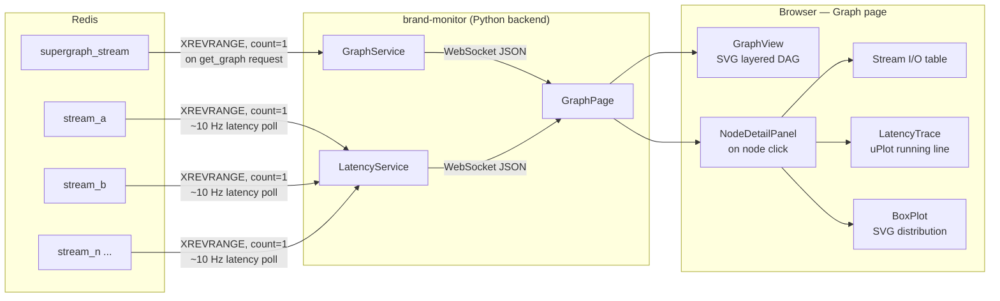

# BRAND Graph Visualizer — Design Document

## Overview

The Graph Visualizer is a second page within `brand-monitor` that displays
the structure of the currently running BRAND graph in a browser. It shows nodes as
boxes arranged left-to-right in data-flow order, with edges representing shared Redis
streams connecting them. Clicking a node reveals its input/output streams (including
field names and dtypes), and live latency measurements with a running trace and
distribution plot.

The feature requires no changes to any other BRAND node and introduces no new
dependencies for the graph itself — it reads the same Redis data that the supervisor
and nodes already publish.

---

## Goals

- Display the full node topology of the running graph at a glance
- For each node, show which Redis streams it reads from and writes to, and the schema
  (fields, dtypes, channel count, approximate rate) of those streams
- Measure and display processing latency per node, both as a running trace and as a
  statistical distribution
- Require zero changes to existing graph nodes or YAML files

## Non-Goals

- Modifying or reconfiguring the running graph
- Controlling graph execution (start/stop/restart nodes)
- Replacing the BRAND supervisor UI

---

## Integration Point

The Graph Visualizer is a **second page** inside `brand-monitor`. The React
frontend gains a tab bar (Signal Viewer | Graph), and the Python backend gains two
new WebSocket message handlers. No new node, port, or service is needed.

---

## Architecture



---

## Backend

### Topology Discovery

On a `get_graph` WebSocket request from the browser, the backend:

1. Reads the latest entry from `supergraph_stream` with `XREVRANGE count=1`.
   The entry contains the serialized graph YAML under a known field key.
2. Parses the YAML into a node list. Each node record has `nickname`, `name`,
   `module`, `run_priority`, and `parameters`.
3. Calls `SCAN` (or `KEYS *`) to enumerate all live Redis stream names.
4. For each node, walks its `parameters` dict recursively and collects any string
   values (or list-of-string values) that exactly match a live Redis stream name.
   These are the node's candidate I/O streams.
5. Classifies streams as **input** or **output** using a two-pass heuristic:
   - A stream that is a candidate for node A and also a candidate for node B creates
     a directed edge A → stream → B.
   - If a stream appears as a candidate in only one node, it is labelled as a source
     (unknown upstream) or sink (unknown downstream).
   - Since many BRAND nodes follow a naming convention (`in_stream` / `out_stream`
     / `streams` keys), the parameter key name is used as a strong hint when present.
6. Augments each stream entry with its schema from the stream manifest (dtype,
   n_channels, fields, approximate rate) — reusing the same manifest-building
   logic already in `signal_visualizer.py`.
7. Returns a `graph_topology` WebSocket message (see Protocol section).

The topology is rebuilt on each `get_graph` request (and optionally re-sent if the
supergraph changes). It is **not** polled continuously — the graph structure is
static during a run.

### Latency Measurement

Latency for a node is defined as:

```
latency_ms = output_stream_id_ms − max(input_stream_id_ms)
```

where `output_stream_id_ms` is the millisecond timestamp embedded in the latest
Redis entry ID of the node's primary output stream, and `input_stream_id_ms` is
the same for each of the node's input streams. For nodes with multiple inputs, the
most recent input timestamp is used (the last input to arrive in that processing
cycle).

The `LatencyService` runs a background coroutine that:

1. Polls at ~10 Hz (every 100 ms) — much lower than the signal viewer's 60 Hz,
   since latency distributions change slowly.
2. For each node that has at least one known input stream and one output stream,
   calls `XREVRANGE <stream> + - COUNT 1` for each relevant stream (one call per
   stream, batched where possible).
3. Computes the latency sample and appends it to a per-node ring buffer
   (2 minutes × 10 Hz = 1 200 samples per node).
4. Pushes a `latency_update` message to all connected WebSocket clients
   subscribed to graph latency.

Nodes with no detectable output streams (e.g. pure display nodes) are shown in the
graph but have no latency panel.

**Limitations:** This method measures the lag between the timestamp embedded in the
output Redis entry ID and the timestamps of the input entries. It is accurate to
~1 ms (Redis ID resolution) but does not account for within-batch latency (a node
may process several input samples per output entry). For neural decoding pipelines
this is the most meaningful latency metric.

### New WebSocket Messages

**Client → Server:**

| Message type | Payload | Description |
|---|---|---|
| `get_graph` | — | Request full topology + current stream schemas |
| `subscribe_graph_latency` | — | Start receiving `latency_update` messages |
| `unsubscribe_graph_latency` | — | Stop receiving latency updates |

**Server → Client:**

| Message type | Payload | Description |
|---|---|---|
| `graph_topology` | See below | Full node/edge/stream schema snapshot |
| `latency_update` | See below | Per-node latency batch (~10 Hz) |

**`graph_topology` payload:**
```json
{
  "type": "graph_topology",
  "nodes": [
    {
      "nickname": "bin_multiple",
      "name":     "bin_multiple",
      "module":   "brand-modules/bin_multiple",
      "run_priority": 99,
      "in_streams":  ["threshold_values"],
      "out_streams": ["binned_spikes"],
      "parameters":  { "bin_size": 20 }
    }
  ],
  "streams": {
    "binned_spikes": {
      "samples": {
        "dtype": "int8", "n_channels": 192,
        "approx_rate_hz": 100, "suggested_viewer": "raster"
      }
    }
  },
  "edges": [
    { "from": "bin_multiple", "to": "wiener_filter", "stream": "binned_spikes" }
  ]
}
```

**`latency_update` payload:**
```json
{
  "type": "latency_update",
  "samples": {
    "bin_multiple":   [12.3, 11.8, 13.1, 12.6],
    "wiener_filter":  [5.2, 4.9, 5.0, 5.1]
  },
  "t": 1234567890.123
}
```

---

## Frontend

### Navigation

A minimal tab bar is added to the top of the existing dashboard:

```
[ Signal Viewer ]  [ Graph ]
```

Tab state is managed in `App.tsx` with a simple `activePage` string — no React
Router is needed given there are only two pages.

### Graph View (`GraphView.tsx`)

An SVG-based layered DAG rendered inside a scrollable `div`. Layout algorithm:

1. **Topological sort** of nodes using Kahn's algorithm (the graph is a DAG by
   construction — BRAND graphs have no feedback within a single processing cycle).
2. **Layer assignment**: each node's layer = longest path from any source node to
   that node (critical path depth). Sources are layer 0.
3. **Within-layer ordering**: nodes in the same layer are stacked vertically and
   sorted to minimize edge crossings (a single-pass barycentric heuristic is
   sufficient for typical graph sizes of 5–20 nodes).
4. **Coordinates**: `x = layer × LAYER_STRIDE`, `y` evenly distributed within layer.
5. **Edges**: cubic Bézier curves from the right edge of the source node rectangle
   to the left edge of the target, labelled with the stream name near the midpoint.
6. **Unknown sources/sinks**: streams with no detectable upstream/downstream node
   are rendered as small circular input/output ports at the graph boundary.

Node boxes display: `nickname`, module short name, run_priority badge.

### Node Detail Panel (`NodeDetailPanel.tsx`)

Slides in from the right when a node is clicked (or appears below the graph on
narrow viewports). Contains three sections:

**Streams I/O table**

| Direction | Stream | Fields | dtype | Ch | Rate |
|---|---|---|---|---|---|
| ← in | `threshold_values` | `samples` | int8 | 192 | 1000 Hz |
| → out | `binned_spikes` | `samples` | int8 | 192 | 100 Hz |

**Latency trace** — a uPlot line chart showing the last 60 seconds of latency
samples for this node (reuses the existing `TimeSeriesViewer` infrastructure but
with synthetic `DataBatch` objects constructed from `latency_update` messages).

**Latency distribution** — an SVG box-and-whiskers plot over all retained samples
(up to 2 minutes). Displays: min, p5, p25, median, p75, p95, max. A second
overlay shows a thin violin/density estimate (kernel density, binned into 30
buckets) alongside the box if enough samples are available (≥ 50).

### Latency Distribution Chart (`LatencyBoxPlot.tsx`)

Pure SVG component. Given an array of latency samples (ms), renders:
- A horizontal box spanning p25–p75, with a vertical median line
- Whiskers to p5 and p95, with small caps
- Individual outlier dots beyond p5/p95
- Optional KDE curve overlaid as a filled path
- X-axis in milliseconds, auto-scaled to [0, p99 × 1.1]

---

## Data Flow Summary

```
Page load
  └─► App sends get_graph
        └─► Backend reads supergraph_stream, scans Redis streams
              └─► Returns graph_topology
                    └─► GraphView renders SVG DAG

User clicks node
  └─► NodeDetailPanel opens
  └─► App sends subscribe_graph_latency (if not already subscribed)
        └─► Backend starts 10 Hz latency poll
              └─► latency_update messages arrive
                    └─► LatencyTrace updates (uPlot)
                    └─► LatencyBoxPlot re-renders (SVG)

User closes panel / navigates away
  └─► App sends unsubscribe_graph_latency
```

---

## Implementation Plan

### Phase 1 — Topology display (no latency)

- [ ] Backend: `_build_graph_topology()` method — reads `supergraph_stream`,
      scans Redis stream names, infers I/O via parameter heuristic, returns JSON
- [ ] Backend: `get_graph` WebSocket handler
- [ ] Frontend: `GraphPage.tsx` — tab navigation, holds graph state
- [ ] Frontend: `GraphView.tsx` — SVG DAG with layered layout
- [ ] Frontend: `NodeDetailPanel.tsx` — stream I/O table only
- [ ] Tab bar in `App.tsx`

### Phase 2 — Latency measurement

- [ ] Backend: `LatencyService` — 10 Hz polling coroutine, ring buffer
- [ ] Backend: `subscribe_graph_latency` / `unsubscribe_graph_latency` handlers
- [ ] Frontend: `LatencyBoxPlot.tsx` — SVG box-and-whiskers + KDE
- [ ] Frontend: `LatencyTrace` — uPlot running line (adapt existing TimeSeriesViewer)
- [ ] Wire latency panels into `NodeDetailPanel`

### Phase 3 — Polish

- [ ] Handle unknown sources/sinks gracefully (boundary ports)
- [ ] Highlight edges for the selected node
- [ ] Aggregate latency box-and-whiskers for all nodes in a summary view
- [ ] Auto-refresh topology if `supergraph_stream` changes (detect via stream ID)

---

## Open Questions

- **supergraph_stream field key**: The exact field name within the Redis stream entry
  that holds the YAML string needs to be verified against the supervisor's write code.
  Working assumption: field name is `data` or the graph nickname.
- **Parameter heuristic accuracy**: For nodes with non-standard parameter naming, the
  stream-name matching heuristic may miss connections or produce false edges. A
  `graph_hints` top-level YAML section (analogous to `display_hints`) could allow
  explicit override — deferred to Phase 3.
- **Multi-output nodes**: Some nodes may write to several output streams. The latency
  definition above picks the primary output; we need to decide which stream is
  "primary" (lowest latency? highest rate? first listed?).
- **Supervisor node**: The supervisor itself may appear as a node in the topology.
  Should it be shown, hidden, or rendered differently?
